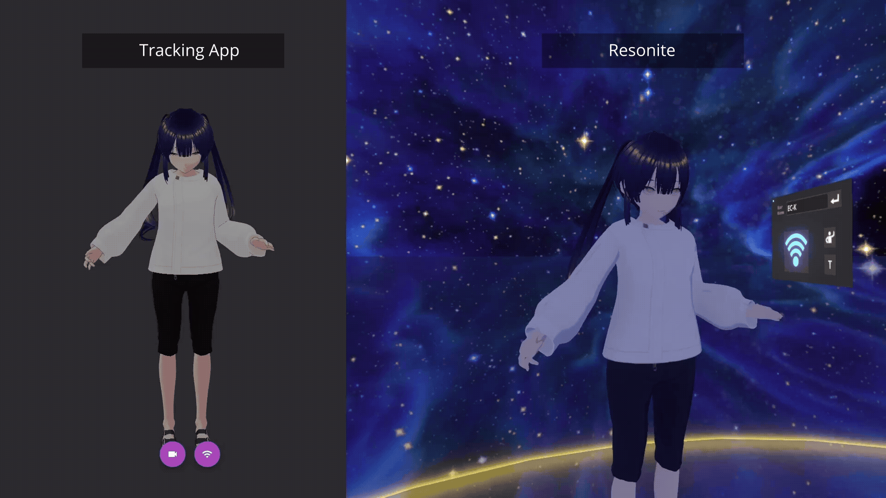
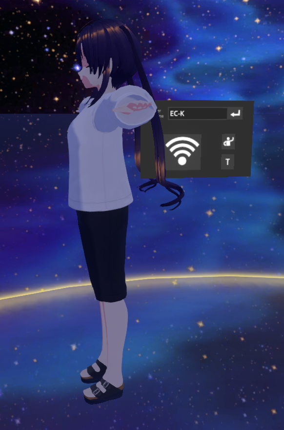
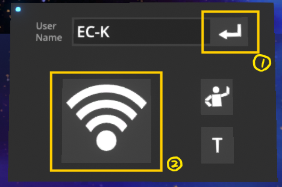
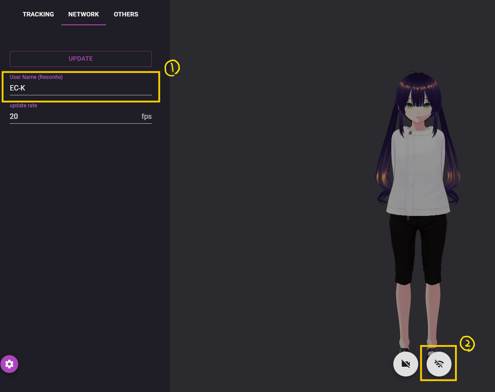

# Violet Marionette Web

Violet Marionette Web は，Resonite のアバターを Web カメラによるトラッキングで動かせるWebクライアントアプリです．



## 実行

本システムは，3つの構成要素から成ります．

1. トラッキングとデータ送信を行うクライアント
2. 動作データを受け取り，それをResoniteのアバターに反映するResoniteアイテム
3. 1と2を接続するためのブリッジサーバー

### クライアントの実行

以下のいずれかの方法により実行してください．

#### GitHub Pages

クライアントはGitHub Pagesでホストされています．

- <https://ec-k.github.io/violet-marionette-web/>

#### ローカルでの実行

1. 必要なパッケージをインストールしてください．

```bash
npm install
```

2. クライアントアプリを立ち上げてください．

```bash
npm run dev
```

3. 実行後，viteにより提示された URL にアクセスしてください．

### ブリッジサーバーの実行

Resoniteのアバターに同期する場合，ブリッジサーバーが必要です．`bridge-server.js`をダウンロードし，実行してください．（クローンした場合はダウンロードは不要です）

```bash
node bridge-server.js
```

### Resonite Receiver の実行

> [!CAUTION]
> 高頻度の同期処理を発火させるため，他者に負荷をかけます．3人以上からセッションがかなり不安定になるので，本アイテムの利用をお勧めしません．
>
> また，ResoniteにおいてWebSocketメッセージを高頻度で送信するとセッションがクラッシュすることを確認しています(2025-08)．したがって，このシステムを利用すると**他者に迷惑をかける可能性がかなり高い**です．したがって，個人で試すか，他者の許しを得てから利用してください．

1. 以下のURIをコピーし，Resoniteを開いた状態でペースト（Ctrl+V）してください．下図のようなアイテムが現れます．
   - resrec:///U-ECK/R-f27df342-25c1-4426-890f-937793e47c72



2. UIのUserNameを自身のものに変更し，画像に示されたボタンを順に押してください



3. クライアントも設定してください
   1. 自身のResoniteのユーザ名を指定し，UPDATEボタンを押して情報を更新してください．
   2. 通信ボタンを押してWebSocket通信を有効にしてください



アバターを着なくても動きます．
